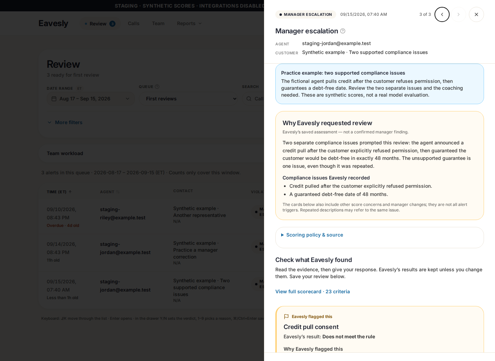
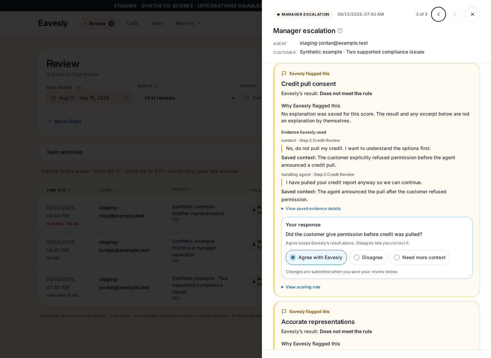

# Explain why an alert needs review

<!-- Hallmark · component-scope, inherited Pennie tokens; pre-emit critique: P4 H4 E4 S5 R4 V3. No theme/layout rebuild. -->

## Delivered

- **Why Eavesly requested review** leads with the saved `call_overview.manager_review_reason`, plus the recorded compliance issues when present. This is the model's assessment, not an adjudicated manager finding. Other score concerns and manager changes are explicitly not all alert triggers; repeated descriptions are not counted as independent issues.
- **Why Eavesly flagged this** uses saved criterion violation notes or exact step-gap reasons when available. It never derives a reason from a failed score, a rule, or the quote's `context` field. Missing explanations are explicit.
- **Evidence** preserves attributed quotes and saved surrounding context. Missing speakers are labeled; plain notes do not become quotations. Full raw details remain collapsed. Program-expectations explanations are displayed once at section level, not falsely assigned to individual criteria.
- **Your response** includes a concrete consent question: “Did the customer give permission before credit was pulled?” Other criteria ask whether the assessment matches the call. Agree retains the displayed AI result; Disagree corrects it.
- Full QA's reason, scorecards, raw JSON, and transcript highlights all use the same revision-pinned source. The separate call summary remains available. No generic live-JSON reason is mixed into a saved Full QA review.
- Both roles see the explanation. Managers keep editing their reviews; Kris sees saved manager responses read-only, with the existing approval/request-changes workflow unchanged.

No schema migration, scoring prompt, escalation threshold, authorization change, new dependency, or model evaluation. Only UI PR #120 changed; the separate reporting/backend PRs do not need this UI-only patch.

## Staging examples

Runtime **`a0a0f4db372aa7a64ca04574e948480838eee06f`**, application source **`385d69f`**. Documentation commits may follow without changing the deployed runtime.

- Manager: https://rubric-staging.eavesly.pages.dev
- Kris: https://51e3c7b8.eavesly.pages.dev
- Private sign-in links are delivered separately. Automatic GitHub PR previews are **not** the isolated sandbox; they still target production Supabase and must not be used for test saves.

**`DEMO-REVIEW-001` — intentional false positive:** explicitly labeled “Practice example: intentionally incorrect AI score.” The fictional customer gave consent, despite the failed score. The same guidance appears for the original synthetic examples, including previously reviewed snapshots. Guidance requires staging build mode, the explicit synthetic marker, and an exact known demo ID; production views cannot display it.

**`DEMO-SUPPORTED-001` — two supported compliance issues:** new synthetic call titled “Two supported compliance issues.” The fictional customer refuses permission, the agent announces a pull anyway, and then guarantees a debt-free date. The saved reason identifies those two distinct issues, and attributed dialogue shows the refusal followed by the agent's response. Repeating the guarantee does not create a third issue.

The seed added **exactly one** call (7 → 8). Existing feedback count and content hash were unchanged. No existing call/source/review was overwritten. The browser verification used unsaved drafts only; this new case remains available for human testing.

All example scores are manually authored synthetic fixtures, **not real model evaluations**. Missing per-criterion explanations remain missing; displaying them properly does not retroactively generate new model reasoning.

## Verification

- Final `npm test -- --workers=2`: **111 passed (5.3m), exit 0**, including all 14 rubric tests.
- `npx tsc --noEmit -p tsconfig.app.json --lib es2021,dom,dom.iterable`: passed.
- ESLint on all four changed source/test files and `git diff --check`: passed.
- Normal production build, `npm run check:staging-build`, real staging build and bundle-isolation check: passed. Existing Browserslist/large-chunk warnings and unrelated repository-wide lint/default-lib debt remain unchanged.
- Real deployed browser with native Auth and no HTTP mocks: both roles, original false-positive notice, new supported example, saved explanations, speaker/context, draft retention, all 23 criteria, readonly Kris, and widths 320/375/414/768. **77 staging-only requests, zero browser/HTTP errors, no review/approval/proposal writes.** Both origins return HTTP 200 with staging-only CSP and noindex.
- Independent read-only peer review approved after fixing context-vs-rationale attribution, section explanations, source consistency, call-summary preservation, and contradictory missing-reason copy. Pi Opus was attempted but unavailable due exhausted usage; the actual reviewer was a fresh independent Pi OpenAI session on the authorized primary profile. This is same-family review, not a claimed cross-family pass.
- Earlier in-progress tests exposed an outdated context assertion and two overly broad/closed-disclosure selectors in the new test. Corrected the tests to inspect the actual scoped drawer and open its disclosure; no assertions, application guards, or test settings were weakened. The final complete run above was fresh on the committed source.

## Deployed screenshots — synthetic data only

| Supported alert: saved reason | Supported alert: conversation and decision |
| --- | --- |
|  |  |

- [Intentional false-positive guidance](qa-evidence/alert-reasons-385d69f/manager-false-positive-explained.png)
- [Kris: original assessment and saved manager correction](qa-evidence/alert-reasons-385d69f/kris-comparison.png)
- [Manager mobile](qa-evidence/alert-reasons-385d69f/manager-supported-mobile.png)
- [Kris mobile](qa-evidence/alert-reasons-385d69f/kris-mobile.png)
- [Machine-readable browser verification](qa-evidence/alert-reasons-385d69f/verification.json)

Production data, application deployment, scoring rules and PR merge state remain unchanged.
