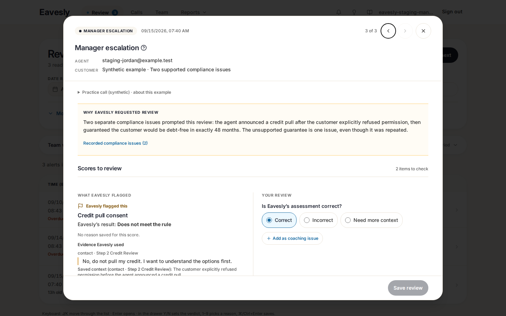
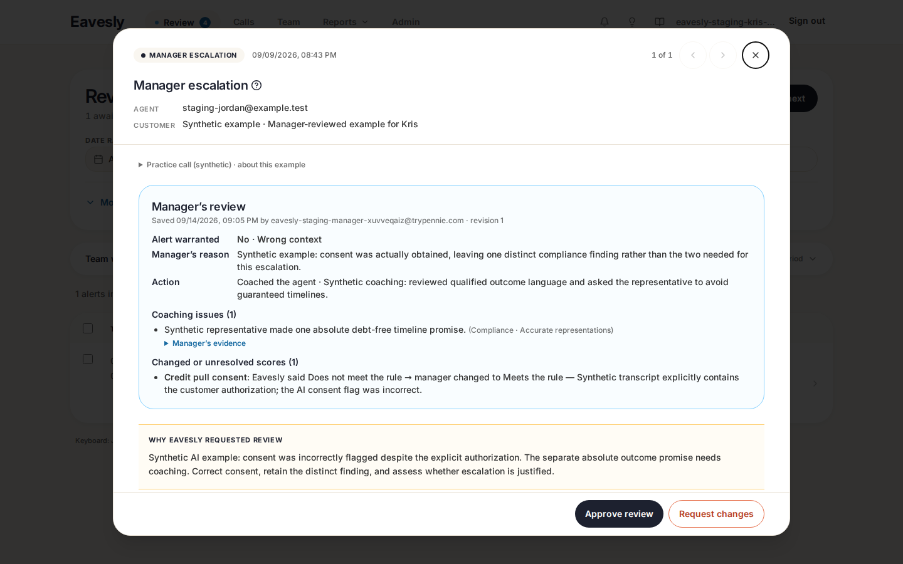
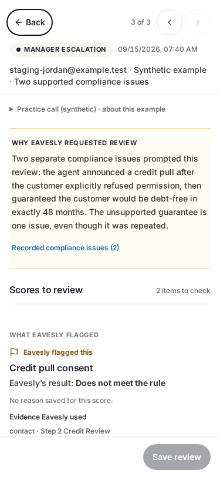
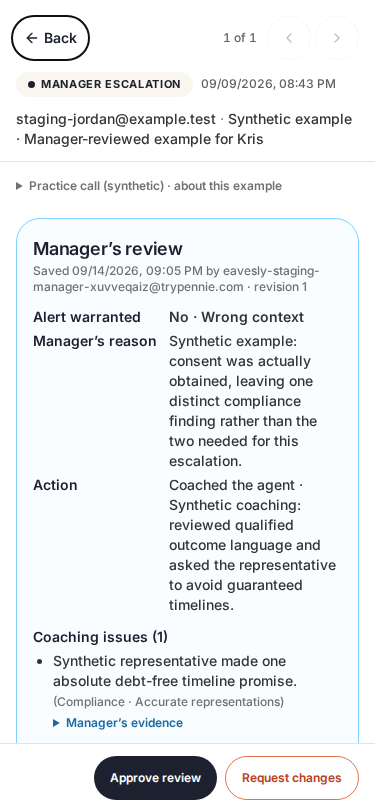

# Floating Full QA review

## Latest follow-up: two response choices

Source `a155517` removes **Need more context** from new responses. Managers choose **Correct** or **Incorrect**; corrections still require a result and explanation. Saved historical needs-context responses remain visible and unchanged in both roles. An unavailable AI score has no preselected response/result and cannot save until a manager explicitly supplies one. No database or scoring contract changed.

Independent Claude Code Fable 5.1 review approved after catching and fixing a missing-score default that could have preselected `pass`. The regression now proves that entering a reason alone cannot enable Save without an explicit result.

Fresh full regression on `a155517`: `npm test -- --workers=1` → **118 passed (6.4m), exit 0**, including all 21 rubric scenarios. An earlier command-budget interruption and subsequent stale-port start were discarded; the final fresh run completed without retries or weakened assertions.

Native staging verification: **199 staging-only requests, zero errors**, both roles and mobile widths, no review/approval/proposal writes; all eight calls and three feedback records have unchanged feedback content. Application TypeScript, changed-file ESLint, normal build, staging build-seam and bundle-isolation checks passed.

Latest screenshots (synthetic only): [Manager desktop](qa-evidence/two-options-a155517/manager-first-1440.png), [manager mobile](qa-evidence/two-options-a155517/manager-first-375.png), [score correction](qa-evidence/two-options-a155517/manager-correction.png), [Kris](qa-evidence/two-options-a155517/kris-first-1440.png), [native verification](qa-evidence/two-options-a155517/verification.json). Earlier screenshots below document the original floating-window iteration.

## Plan delivered

Use more desktop space without adding more information: a centered, viewport-bounded review window, evidence beside the response, and secondary details on demand. Reuse the existing Radix dialog primitive; preserve the existing review contract.

- **Desktop:** Full QA opens in a centered window up to 1,080px wide and 90dvh tall. Each criterion has aligned **What Eavesly flagged** / **Your review** areas. Fewer nested boxes, with whitespace and dividers instead.
- **Mobile:** full-screen, stacked evidence then response. The saved reason is no longer truncated. Long real explanations/evidence can require scrolling before the response; this intentionally replaces the previous first-screen-fit target. The action footer remains visible.
- **Manager:** all 23 criteria, categorical corrections, explicit coaching findings, separate alert verdict, source/revision guards, draft protection and keyboard save are retained.
- **Kris:** the saved manager outcome remains first, with read-only evidence and persistent Approve / Request changes. The first Request changes click opens instructions, not an empty submission.
- **Historical feedback:** original manager feedback is now visible when a successful Full QA context has no structured review. It is labeled **Earlier manager review**; no individual score corrections or confirmed findings are invented. Structured pinned reviews stay authoritative; a context error does not trigger a fallback.
- Generic, non-Full-QA alerts keep their existing slide-out. No new dependencies, database/API/scoring/auth changes, model runs or production deployment.

## Real production-data check

Read-only inspection of the Eavesly production Supabase project found 1,550 sent Full QA alerts in the preceding 90 days. A **purposive sample of 24 genuine alerts** covered recent calls, the longest saved reasons, lengthy evidence, many compliance flags, manager-confirmed alerts, manager-marked false alarms and unreviewed alerts. This is layout/behavior coverage, **not a statistical accuracy evaluation**.

- 11 manager-confirmed, 5 manager-marked false alerts, 8 unreviewed.
- Saved reasons ranged from **106 to 828 characters**; largest stored result was **19,093 characters**.
- The production structured-rubric revision table is not deployed and these sources have no prompt provenance stamps. The preview therefore uses the real current reference catalog with **Original rubric unknown; current reference only**. It does not claim an exact historical rubric.
- The raw AI result, original feedback and current decision metadata were preserved in private local replay. Native production reads used Supabase MCP for discovery/aggregate inspection and the Management API's dedicated read-only query endpoint for private export. Separate full-transcript, recording, customer-phone and CRM-link fields were not fetched.
- **No production mutations or permission changes. No customer records in hosted staging, Git, PR images or public logs.** The local browser uses intercepted HTTP responses and blocks unexpected external destinations; no real production session token is present. Customer screenshots and diagnostics remain private.
- Local replay is not proof of production RPC/Auth behavior. The isolated staging check separately exercises native Auth with synthetic records and distinct manager/Kris accounts.

The real-data inspection exposed the historical-feedback visibility gap fixed above; testing only the synthetic structured-review examples would have missed it.

## Original floating-window verification

- Final `npm test -- --workers=1`: **117 passed (5.6m), exit 0** on application source `097a2a4`.
- Focused Full QA suite: **20/20 passed**; adjacent manager suite: **12/12 passed**.
- Private real-source replay: **40/40 passed (98.9s)** across 24 manager and 16 Kris views. Every scenario checks desktop/mobile geometry, complete saved reason, overflow, fixed action placement, and applicable original feedback. Manager cases additionally check aligned evidence/response, all 23 criteria, retained drafts and no saves. Zero external browser traffic or mutations. All 24 desktop first-open captures were visually inspected privately.
- ES2021 application TypeScript, ESLint on all five changed files, and diff checks: passed. Normal build **15.37s**; staging build-seam check and real bundle-isolation checks: passed. Existing Browserslist/chunk warnings and unrelated whole-repository lint/default-library debt remain unchanged.
- Real deployed native-auth browser: **199 staging-only requests, zero browser/console/HTTP errors**, both roles, centered geometry, full-screen mobile, untruncated reason, draft retention, full scorecard, explicit coaching, request-changes focus and approval draft guard. Widths 320/375/414/768 checked. No review, approval or proposal saved.
- Both origins: HTTP 200, stage-only CSP, noindex, no-referrer and no-store. Staging remains **8 calls / 3 feedback records with unchanged feedback-content hash**.
- Cross-family independent review: Sol implemented; Claude Code Fable 5.1 approved final commit `097a2a4` after rechecking Full-QA-only focus handling, historical-feedback guards, layout and test coverage. No blockers. Mobile full-reason trade-off is explicit above.

During implementation, assertions that expected an expansion button or a gap between adjacent grid cells were updated to the new visible-full-reason and shared-divider behavior. Final tests were fresh; no timeouts, retries, role gates or persistence safeguards were weakened.

## Isolated staging

Latest application source **`a155517c5969913e3384339fe786a7d70a590de0`**; deployed runtime **`5fe9bb3d5b0f04d6f957ed1e7f7e08a431f732a9`** with staging-only configuration. Subsequent documentation-only commits do not alter runtime.

- Manager: https://rubric-staging.eavesly.pages.dev — start with `DEMO-SUPPORTED-001`.
- Kris: https://63aa7a17.eavesly.pages.dev — start with `DEMO-APPROVAL-001`.

Private one-use native-auth links are delivered separately. These two origins isolate browser storage for the two test accounts. **Automatic PR previews are not this sandbox; do not use them for test saves.** Hosted examples remain synthetic.

## Screenshots — synthetic staging only

| Manager desktop | Kris desktop |
| --- | --- |
|  |  |

| Manager mobile, first open | Kris mobile, first open |
| --- | --- |
|  |  |

- [Unsaved coaching draft](qa-evidence/floating-review-097a2a4/manager-coaching-draft.png)
- [Unsaved score correction](qa-evidence/floating-review-097a2a4/manager-correction.png)
- [Native staging browser verification](qa-evidence/floating-review-097a2a4/verification.json)
- [Sanitized aggregate production-layout verification](qa-evidence/floating-review-097a2a4/production-layout-verification.json) — no customer identifiers or source text.

No PR merge or production deployment was performed.
