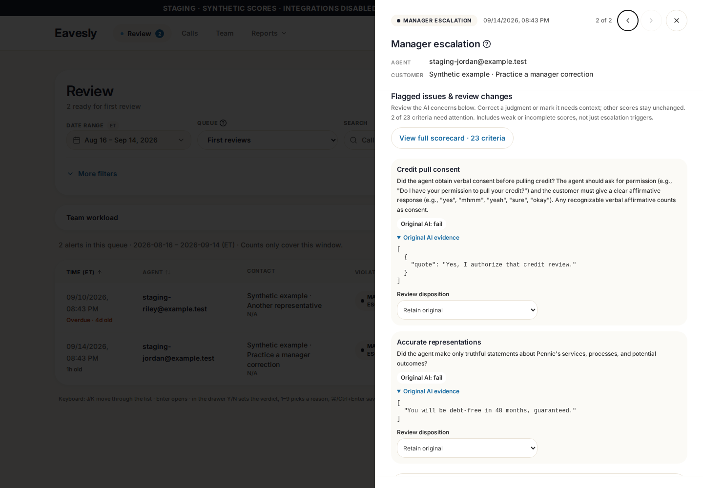
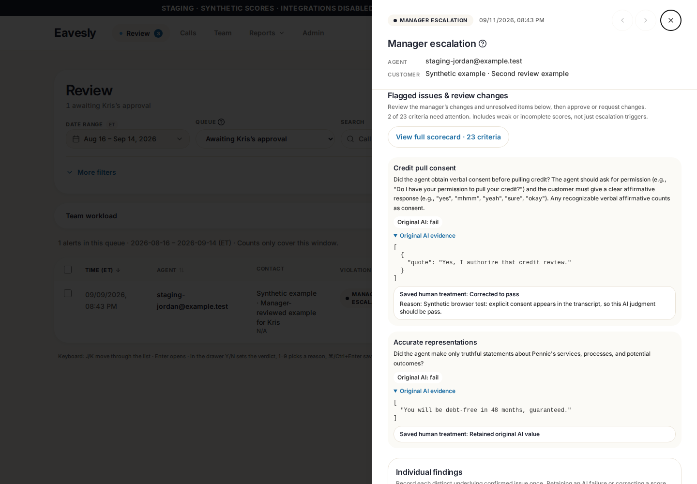

# Focused Full QA alert scorecard

Source commit: `94ffe171ba239159b9e1326e3250d951196a5c97` on rubric PR #120, stacked on reporting PR #119. Deployed isolated preview: `8969cda72dfb6560ff9516f9a36b4e3213d419db` (the same source change plus the existing staging-only client/build configuration).

## Behavior

- Alerts show AI concerns and saved/draft human changes first, not the entire 23-criterion scorecard. The synthetic practice alert now starts with **2 of 23 criteria**.
- Focus includes `fail`, `poor`/`fair`, `missing`/`partial`, applicable uncovered program-expectations items, unavailable scores, human corrections/needs-context items, and criteria linked to findings. Program coverage marked not applicable or enrollment not completed is not presented as a failure just because its coverage boolean is false.
- **View full scorecard · 23 criteria** reveals every result. Collapsing preserves drafts and leaves changed/context-needed criteria visible. All 23 treatments are still validated and saved, including unchanged hidden results.
- Managers retain their existing correction/coaching controls. Kris sees saved human treatment read-only when reviewing another manager's work and retains the existing approve/request-changes workflow. Expanding never grants additional permissions.
- Scoring policy and source details are collapsed; legacy/unknown-source warnings remain visible. The original AI result is never replaced by a correction. Display filtering is not an escalation rule and never clears an alert.
- Initial server loading no longer transiently marks an untouched review dirty or blocks browser Back with a false discard prompt. Real draft/stale-source guards remain active.

No scoring prompt, calibration harness, database migration, authorization policy, or backend changed. No saved staging reviews were altered by the new live-browser verification.

## Isolated staging

- Manager: https://rubric-staging.eavesly.pages.dev
- Kris: https://27545996.eavesly.pages.dev

These origins use staging Supabase `xuvveqaizlletsqvwpgx`, with separate authenticated accounts/storage. Private one-use access links are issued separately; never commit them. **Do not use automatic PR previews for test saves: those still use production Supabase.** No PR was merged or production application deployed.

## Evidence

The screenshots below use synthetic data and were captured on the deployed staging build, not mocked HTTP responses.

| Manager | Kris |
| --- | --- |
|  |  |
| [Full scorecard](qa-evidence/focused-scorecard-94ffe17/manager-full-scorecard.png) | [Full scorecard, read-only](qa-evidence/focused-scorecard-94ffe17/kris-full-scorecard.png) |

[Manager mobile](qa-evidence/focused-scorecard-94ffe17/manager-focused-mobile.png) · [Live-browser verification](qa-evidence/focused-scorecard-94ffe17/verification.json)

Verification:
- Fresh full regression: `npm test -- --workers=1` → **104 passed (4.9m), exit 0** after the navigation fix.
- Focused rubric browser tests: 7 passed. Coverage includes categorical/boolean concerns, enrollment gating, empty/unavailable values, full-scorecard editing, retained hidden values, manager-to-Kris flow, and stale drafts.
- Navigation regression: reproduced the false discard prompt, fixed the initialization guard, then 5 consecutive runs passed without retries or waits added to hide the race.
- App TypeScript with ES2021 lib, targeted ESLint, normal build, staging build-seam checks and real staging bundle-isolation checks passed.
- Live native auth/browser: focused subset, full23 toggle, unsaved context-edit retention, read-only Kris corrections, widths320/375/414/768, zero errors and no non-staging destinations. No review/approval/proposal mutation RPCs were sent.
- Independent read-only peer review found no remaining blockers. Same-family OpenAI fallback was disclosed: the two attempted Claude profiles failed before review on usage/auth availability; no cross-family review is claimed.
- Repository-wide lint remains blocked by 45 errors and 6 warnings in untouched files; changed files lint clean. The default TypeScript project also retains its pre-existing ES2021 `replaceAll` target mismatch; the explicit app check above passes.
