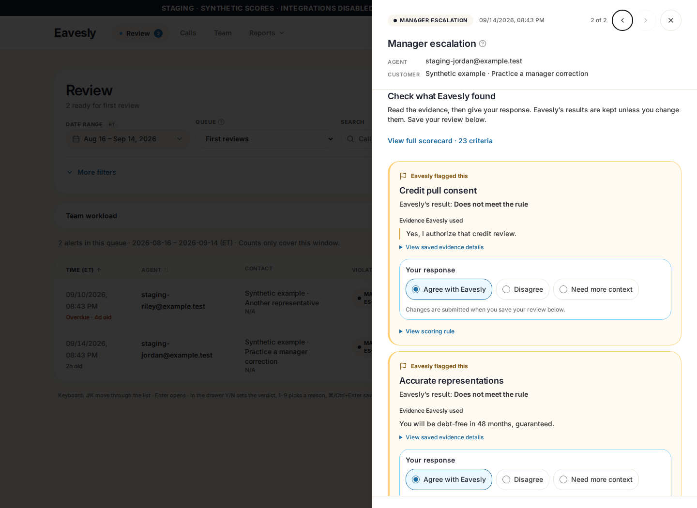
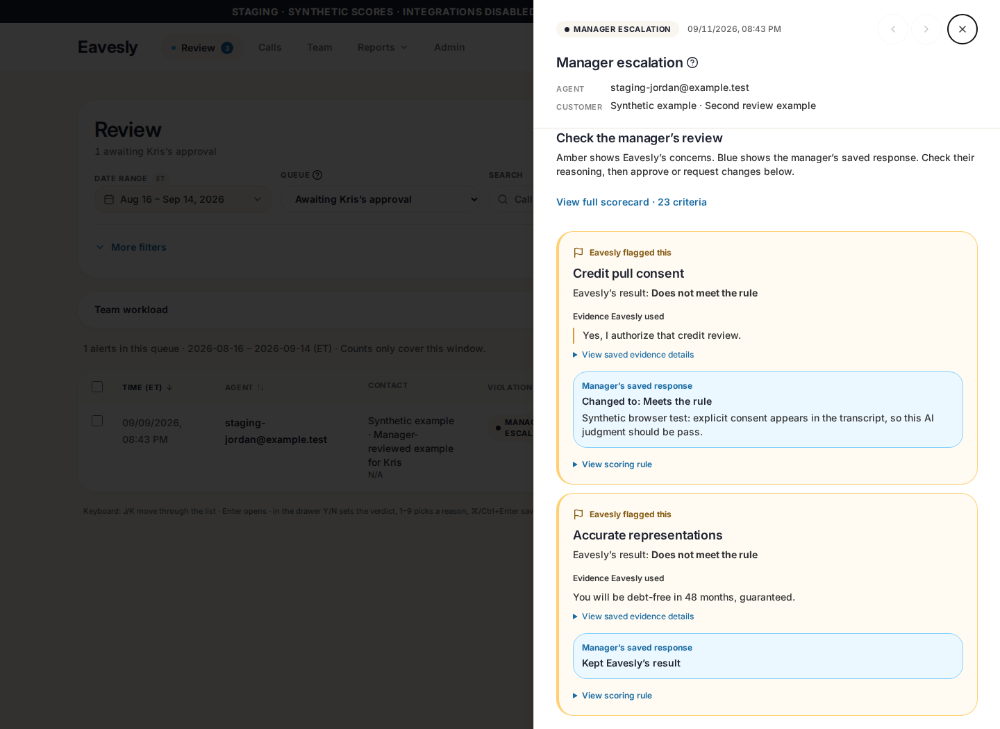

# Visually clear alerts for sales managers

## Plan and scope

Goal: a sales manager should immediately recognize **what Eavesly flagged, what evidence it used, and where to respond** without understanding scorecard terminology.

1. Put a flag icon and **Eavesly flagged this** label above each failed criterion. Use an amber border/background for Eavesly concerns, blue for human responses, and neutral styling for other scores. Labels—not color alone—carry the meaning.
2. Show readable evidence first. Preserve speaker/context when available. Render only explicit `quote` fields as quotations; string notes remain notes. Keep complete original evidence and scoring rules in secondary disclosures.
3. Show native radio choices: **Agree with Eavesly · Disagree · Need more context**. Ask for the corrected result/reason only when relevant. Explain that unchanged results are retained and responses are submitted on save.
4. Give Kris a clear comparison: original Eavesly result and **Manager’s saved response**. Do not turn his approval view into an editable manager form.
5. Use everyday headings: **Issues to coach**, **Should this alert have been sent?**, and **Save review**. Keep the full 23-criterion scorecard available without making it the primary visual action.

In place: `src/components/alerts/FullQaRubricReview.tsx`, its browser tests and one scoped fixture option. No new dependencies, schema migrations, scoring prompts, escalation rules, authorization changes, or other repo PR changes. Existing 23-treatment persistence, saved-source/revision guards, draft protection and approval/coaching semantics remain intact.

## Implementation and preview

- Application source: `f142c4110b7e02c8b3bee7d3f99be5e281c2ae87`, PR #120 (stacked on reporting PR #119).
- Staging runtime: `124835f90516bac91d4cab19b9039eb2779710e3`, same application change plus the existing isolated staging configuration.
- Manager: https://rubric-staging.eavesly.pages.dev
- Kris: https://2be7002a.eavesly.pages.dev

Private short-lived sign-in links are delivered separately. Do not commit access links, tokens or credentials. These previews target only the synthetic staging Supabase project; automatic PR previews still target production and must not be used for test saves. No PR merge or production application deployment was performed.

## Verification

- `npm test -- --workers=2`: **106 passed (4.8m), exit 0** on the final source.
- `npm test -- tests/full-qa-rubric-feedback.spec.ts --workers=1`: **9 passed** after the final source change.
- ES2021 app TypeScript and changed-component/test ESLint passed; normal build, staging build-seam and real staging bundle-isolation checks passed. Existing large-chunk/Browserslist build warnings remain.
- Real deployed browser, native auth, no HTTP mocks: 2 focused manager items / all 23 on demand; readable quotes; native radio disagreement with draft reason preserved across toggles; Kris has 0 editable items and blue saved responses; mobile widths 320/375/414/768; 53 requests only to the two preview origins and staging Supabase; zero browser errors.
- Live verification made **no saved review, approval or rule-proposal mutations**. Existing user test work was preserved; screenshots showing manager disagreement are unsaved drafts.
- Independent read-only OpenAI peer review identified one valid-score-label fallback issue. Fixed and browser-tested with unfamiliar valid string values; reviewer rechecked and approved with no blockers. Same-family fallback, not cross-family review; Claude accounts were unavailable in the preceding work.
- Repository-wide pre-existing lint/default-TypeScript-lib debt remains as documented in the previous focused-scorecard handoff; no checks were weakened.

## Screenshots (deployed, synthetic data)

| Manager: Eavesly flag + response choices | Kris: Eavesly result + manager response |
| --- | --- |
|  |  |

- [Manager disagreement](qa-evidence/visual-flags-f142c41/manager-disagrees.png)
- [Full scorecard, with neutral unflagged results](qa-evidence/visual-flags-f142c41/manager-full-scorecard.png)
- [Manager mobile](qa-evidence/visual-flags-f142c41/manager-mobile.png)
- [Kris mobile](qa-evidence/visual-flags-f142c41/kris-mobile.png)
- [Machine-readable live-browser evidence](qa-evidence/visual-flags-f142c41/verification.json)
