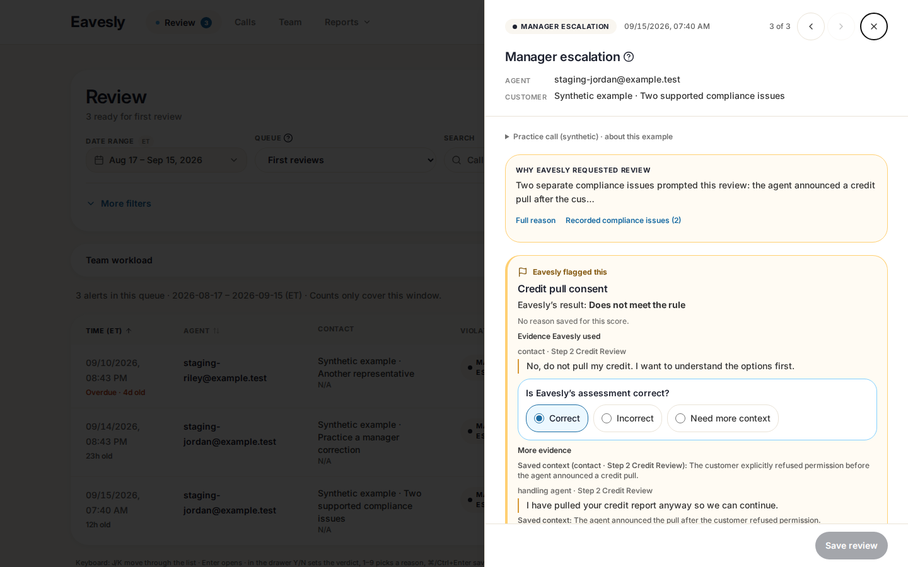
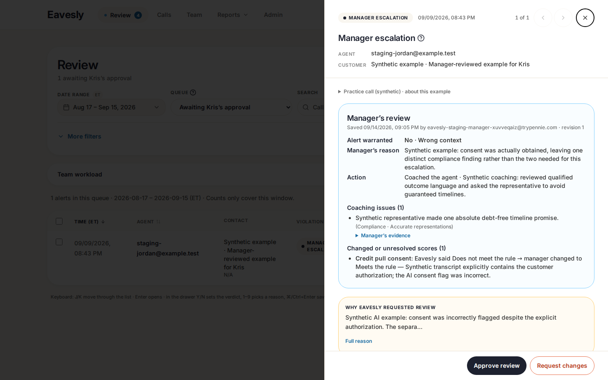
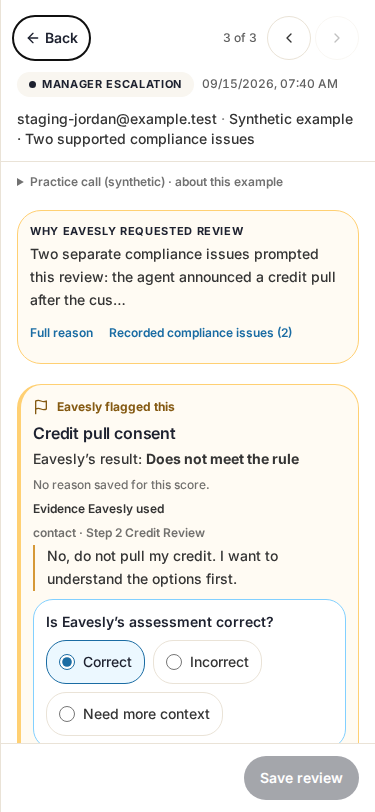
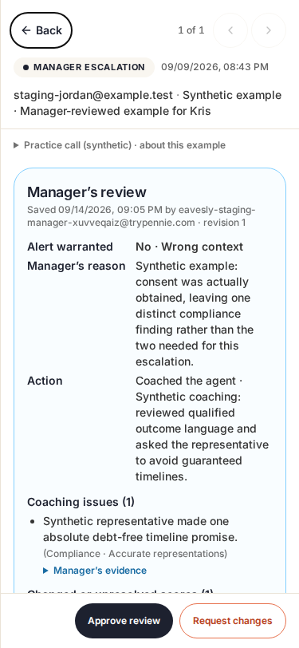

# Task-first alert review

Historical iteration. See [Floating Full QA review](floating-alert-review.md) for the current centered window, staging origins, production-data checks and screenshots.

## Plan and delivered behavior

The problem was not missing information: it was that managers had to scan too much before finding the decision. This iteration keeps the existing scoring/review contract and changes the order and emphasis.

- **Manager:** saved alert reason → flagged assessment and first attributed excerpt → **Correct / Incorrect / Need more context**. Additional evidence, the full 23-criterion scorecard, policy, recording and transcript stay available on demand. No new model explanation is inferred when a saved reason is missing.
- **Coaching:** **Add as coaching issue** explicitly starts a draft using that criterion and its saved evidence. The manager writes the summary. Merely keeping or correcting a score never creates a finding. Multiple criteria can describe one issue; distinct issues can share a criterion. Coaching remains separate from whether the escalation was warranted.
- **Save:** a persistent footer keeps Save/Update available while scrolling. The alert verdict is not preselected. Validation, stale-source protection, unsaved-draft navigation guards and busy-state protection still apply, including the keyboard shortcut.
- **Kris:** the saved manager outcome, reason, coaching action, findings and score corrections come first—not a disabled copy of the manager form. Approve / Request changes remain visible. Request changes first opens and focuses the instructions field; it does not submit an empty decision. Written instructions block approval until sent or cleared.
- **Less competing UI:** compact mobile identity, a quiet synthetic-practice disclosure, no redundant pending-approval banner, and secondary details below the task. All three complete assessment choices fit above the footer in the tested 375×812 first-open screen, without scrolling or focusing a control first.

No database/schema, API contract, scoring prompt, escalation threshold, authorization, dependency or paid-evaluation changes. Only UI PR #120 needs this update; other reporting/backend PRs are unchanged.

## Staging

- Application source: **`52b91ea`** (including `231416f` and `f2da34f`).
- Deployed runtime, with isolated-staging configuration: **`b7b8f3bc996c73fff6fa95303d28cc97dd21b928`**.
- Manager: https://rubric-staging.eavesly.pages.dev
- Kris: https://0776b3ee.eavesly.pages.dev

Private one-use sign-in links are delivered separately. The two origins use separate native Auth accounts and browser storage; the account determines permissions. **Automatic GitHub PR previews are not this isolated sandbox and must not be used for test saves.**

Start as manager with **`DEMO-SUPPORTED-001`** for two supported synthetic compliance concerns. Use **`DEMO-REVIEW-001`** to practice correcting the deliberately incorrect consent score. Start as Kris with **`DEMO-APPROVAL-001`**, an existing manager review awaiting approval.

Scores and examples are synthetic, not new AI evaluations. This iteration did not reseed or overwrite any examples. Fresh before/after checks confirm **8 calls, 3 feedback records, unchanged feedback-content hash**. Browser verification used unsaved drafts only.

## Verification and review

- Final focused rubric suite: **18 passed (1.2m)**.
- Final complete regression on `52b91ea`: `npm test -- --workers=1` → **115 passed (5.2m), exit 0**.
- ES2021 application TypeScript check, ESLint on all four changed files, and `git diff --check`: passed.
- Normal production build, staging build-seam check, and real staging bundle/isolation checks: passed. Existing Browserslist/chunk warnings and unrelated repository-wide lint/default-library debt were not changed.
- Real deployed browser, native Auth and no HTTP mocks: **199 requests, only the two staging origins and staging Supabase; zero browser/console/HTTP errors**. Checked distinct roles, first-screen geometry and occlusion, all 23 criteria, retained drafts, categorical correction semantics, explicitly seeded coaching drafts, Kris read-only summary, request-changes focus, approval draft guard and widths 320/375/414/768. No review, approval or proposal was saved.
- Both deployed origins: HTTP 200, staging-only CSP, `noindex`, `no-referrer`, `no-store`.
- Claude Code **Fable 5.1** planned and implemented the main UI change in the requested Herdr pane. A separate read-only **OpenAI Sol** reviewer checked correctness. Parent follow-up fixes received a bounded read-only Fable review. No correctness/security blockers remained. Two low-priority semantic-heading/comment-wording observations were non-blocking.

The initial real-stage geometry check caught the lower mobile response choice overlapping the footer even though the first choice fit. Fixed the spacing/label layout and strengthened the regression to check **every whole label box**, including occlusion; the final real-stage check passes. An earlier two-worker run had two large-list timing failures under machine load; the affected suite passed alone. Test retries/timeouts and application guards were not weakened.

## Commit-pinned screenshots — synthetic data only

These are from the deployed runtime above, not mocked screenshots. The coaching/correction screenshots show **unsaved drafts**.

| Manager: first-open task | Kris: first-open approval |
| --- | --- |
|  |  |

| Manager mobile | Kris mobile |
| --- | --- |
|  |  |

- [Explicit coaching draft](qa-evidence/task-first-52b91ea/manager-coaching-draft.png)
- [Correcting a false-positive score](qa-evidence/task-first-52b91ea/manager-correction.png)
- [Machine-readable deployed-browser verification](qa-evidence/task-first-52b91ea/verification.json)

Production deployment/data/scoring and PR merge state remain unchanged. The staging branch itself is local-only; only the authorized PR source branch is pushed.
